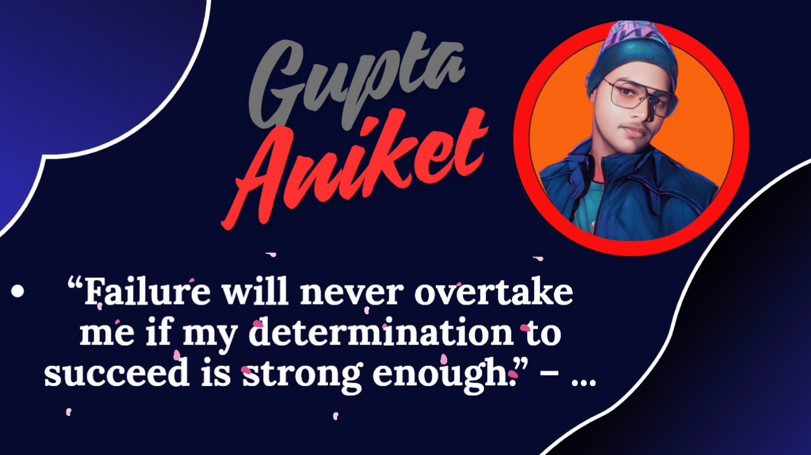

# 💫 About Me:
Hi there! I’m Aniket Gupta 🚀 A Data Analyst & Data Scientist with a knack for transforming raw data into powerful insights, and a Web Developer who loves building sleek, scalable, and user-friendly applications.

  📊 Skilled in Python, SQL, and Machine Learning to uncover trends and make data-driven decisions  🌐 Experienced in Web Development (React, Node.js, Firebase) for creating modern digital solutions  📈 Passionate about Data Visualization & Storytelling using Power BI, Tableau, and Excel  🤖 Exploring the fusion of AI, Data Science, and Web Tech to solve real-world challenges  📚 Lifelong learner, always curious to explore new technologies and sharpen my craft  ⚡ Tech Toolbox  💻 Programming: Python, SQL, JavaScript, HTML, CSS 📊 Analytics & BI: Power BI, Tableau, Excel 🤖 Machine Learning: Scikit-learn, TensorFlow, NLP 🌐 Web Dev: React, Node.js, Firebase 🔧 Version Control: Git, GitHub  🌟 Fun Fact  I believe data is not just numbers—it’s a story waiting to be told!

## 🌐 Socials:
    

# 💻 Tech Stack:
                           
# 📊 GitHub Stats:
 
 

### ✍️ Random Dev Quote

### 🔝 Top Contributed Repo

---

  ## 💰 You can help me by Donating
   

  
<!-- Proudly created with GPRM ( https://gprm.itsvg.in ) -->
